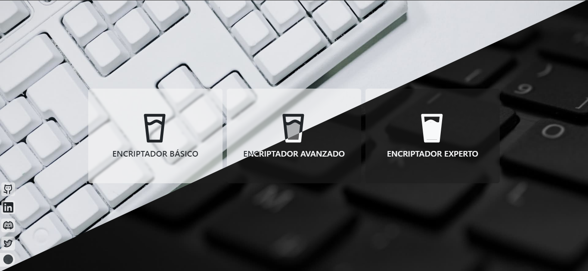

# Encriptador Texto V2

Esta es una versión alterna a la versión realizada en el Challenge ONE Encriptador de Texto

El resultado del mismo

Con las combinaciones de tecla `SHIFT` + `D` podrás cambiar de modo **Dark**/**Light**

Tiene 2 formas de encriptación:
 - La básica: Esta es la que tiene la versión 1
 - La Avanzada: Es otra forma de encriptar sin texto
 - La Experta: _en espera..._

### Versión básica

### Versión avanzada
